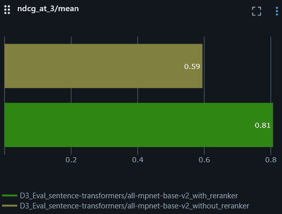
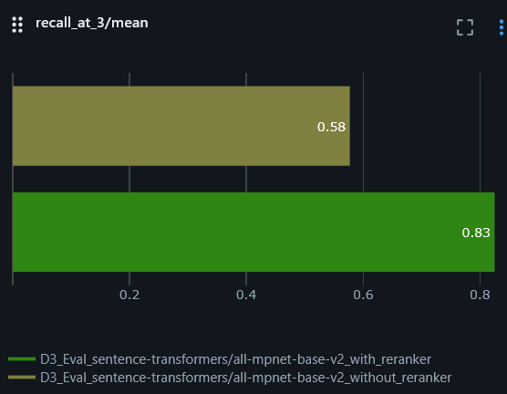
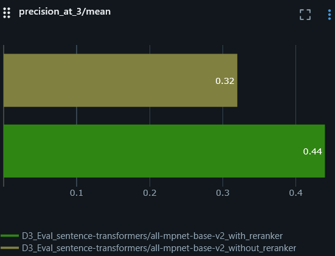

# Advanced RAG System for Semiconductor Documentation

[](https://www.python.org/)
[](https://developer.nvidia.com/cuda-toolkit)
[](LICENSE)

This project is an end-to-end Retrieval Augmented Generation (RAG) system designed for querying and understanding complex *semiconductor technical manuals*. It leverages effective NLP models for embeddings and re-ranking, a robust vector database (PostgreSQL with pgvector) for efficient storage and retrieval, and Google's Gemini-2.0 Flash for generating context-aware answers.

The system is configurable using **Hydra**, allowing for flexible management of parameters for data processing, model selection, database connections, and evaluation. The initial PDF document conversion to Markdown is handled by **Docling** (specifically  with the support of SmolDocling VLM), preserving text, tables, and image references. The key functionalities include data ingestion, advanced retrieval technique, synthetic question generation for evaluation, comprehensive retrieval metrics tracking with **MLflow**, and an interactive **Streamlit** user interface.

## 1. Core Features

- **Hydra-Powered Configuration**: 
    - Centralized and structured configuration management using YAML files for all pipeline components.
- **Flexible Data Ingestion & Processing** (`src/index_docs.py`):
    - Parses the docling-generated Markdown documents using LlamaIndex's `MarkdownReader` and `MarkdownNodeParser` for chunking.
    - Cleans text and extracts embedded images and its alt text into metadata for multi-modal references.
- **Efficient Vector Storage & Indexing** (`src/index_docs.py`):
    - Employs `sentence-transformers/all-mpnet-base-v2` for generating dense text embeddings.
    - Stores text chunks, metadata (including images in base64 format), and embeddings directly in PostgreSQL with the pgvector extension.
    - Implements HNSW indexing for fast and accurate vector similarity search.
    - Optimized batch insertion of data into the database.
- **Retrieval & Re-ranking** (`src/retrieve_docs.py`):
    - Retrieves initial candidate documents using vector similarity search with configurable `hnsw.ef_search` parameters.
    - Enhances retrieval relevance significantly by employing the `mixedbread-ai/mxbai-rerank-xsmall-v1`, a light-weight Cross-Encoder model.
- **Interactive User Interface** (`app.py`):
    - A Streamlit web application allows users to ask questions.
    - Leverages Google's [Gemini 2.0 Flash](https://ai.google.dev/gemini-api/docs/models#gemini-2.0-flash) (configurable via Hydra) to synthesize answers based on the retrieved and re-ranked context.
    - Displays generated answers, source document chunks (with re-ranking scores and metadata), and associated images referenced in the source documents.
- **Synthetic Question Generation for Evaluation** (`evals/question_generation.py`):
    - Uses an Gemini 2.5 Flash Preview 04-17 (leveraging a recent model release at the time of development) with function calling  to generate relevant troubleshooting questions based on specific contexts from the indexed documents.
    - Provides a small dataset for retrieval evaluation.
- **Retrieval Evaluation** (`evals/evaluate_embeddings.py`):
    - Systematically evaluates the performance of embedding and re-ranking models.
    - Uses `mlflow.evaluate` with `model_type="retriever"` to calculate metrics such as nDCG@k, Precision@k, and Recall@k.
- **Tracking with MLflow**:
    - Extensive logging of parameters, metrics (retrieval scores, durations, LLM performance), and artifacts (generated questions, context metadata, prompts, answers) for all key pipeline stages.
    - Supports automatic LlamaIndex event tracing in the Streamlit app if configured.

## 2. Tech Stack & Libraries
- **Configuration:** Hydra
- **Data Preprocessing:** Docling (for processing PDFs efficiently with VLM pipeline and exporting to markdown)
- **Core RAG:**
    - LlamaIndex (for document processing, nodes/chunks creation, orchestration)
    - Sentence Transformers
    - [Google Gen AI Python SDK](https://github.com/googleapis/python-genai) (for accessing Gemini models)
- **Database:**
    - PostgreSQL (version 16.9)
    - pgvector extension
    - psycopg2 (postgres adapter)
- **UI:** Streamlit
- **MLOps & Utilities:**
    - MLflow
    - Pandas
    - PyTorch
    - python-dotenv (primarily for API keys not directly managed by Hydra's main config)
    - uv
- **Environment:**
    - Python 3.12
    - CUDA (for GPU acceleration)

## 3. Setup & Installation

### 3.1. Prerequisites

1.  **Python:** Version 3.12
2.  **[uv](https://docs.astral.sh/uv/) package manager (Recommended, but optional):** Or `pip`/`conda`.
3.  **PostgreSQL:** Running instance with the *[pgvector](https://github.com/pgvector/pgvector) extension* installed and enabled.
4.  **MLflow Server (Recommended):** Running MLflow tracking server.
5.  **Docling CLI (for PDF to Markdown):** Install Docling if you need to process PDFs. Refer to [Docling's GitHub](https://github.com/docling-project/docling) for installation.
6.  **CUDA (For GPU Acceleration):** NVIDIA GPU with atleast 4GB VRAM, relevant drivers.
7.  **Virtual Environment (Recommended):**
    ```bash
    # Create virtual env.
    uv venv .venv # or use venv: python -m venv .venv 
    
    # Activate it
    source .venv/bin/activate # Windows: .venv\Scripts\activate
    ```

### 3.2. Installation Steps

1.  **Clone the Repository:**
    ```bash
    git clone https://github.com/Senthi1Kumar/lynceus-qa-rag.git
    cd lynceus-qa-rag
    ```
2.  **Install Dependencies:**
    ```bash
    uv pip install -r requirements.txt  # Or: pip install -r requirements.txt
    ```
3.  **Configure Hydra:**
    * Review and customize YAML files in the `conf/` directory as per your setup (database, models, paths, API keys referenced from .env file).
4.  **Set Up Environment Variables (for secrets):**
    * Copy `.env.example` to `.env`.
    * Edit `.env` and fill in `GOOGLE_API_KEY` and `DB_PASSWORD` any other secrets your Hydra configs might expect via `${oc.env:VAR_NAME}`.

## 4. Data Preparation

1.  **Convert PDFs to Markdown (using Docling):**
    * If starting from PDF manuals, utilize [Docling's CLI](https://docling-project.github.io/docling/reference/cli/) (with **smoldocling** VLM, which is default model type in VLM pipeline) to parse and convert them into Markdown format. This step extracts text, tables, and embeds images in base64 format.
    * Example:
        ```bash
        docling data/pdfs/doc1.pdf --from pdf --to md --image-export-mode embedded --pipeline vlm --enrich-formula --enrich-picture-description --output data/md/ --device cuda
        ```
    *  Docling's parsed output with VLM support is relevatively good when compared to other PDF parsing libraries such as PyMuPDF, Unstructured. 
    > *Note*: This process of conversion requires adequate time to complete, based on the GPU hardware. One can also use LlamaIndex's LlamaParse document parser via cloud API
2.  The `src/index_docs.py` script will then process these Markdown files.

## 5. Usage

### 5.1. Indexing Documents (`src/index_docs.py`)

This script processes, embeds, and indexes documents into PostgreSQL. It is configured via Hydra.

```bash
python3 src/index_docs.py directory=data/md/ # Uses defaults from `conf/config.yaml`
```
The 'remove_hyperlinks' and 'remove_images' parameters default to false. Set them to true if you wish to exclude this content during parsing
```bash
# python3 src/index_docs.py directory=data/md/ remove_hyperlinks=true remove_images=true
```
*Functionality*:
- Reads configuration from Hydra YAML files.
- Loads and parses Markdown files using LlamaIndex's Markdown node processor.
- Post-processes nodes to extract image paths to metadata.
- Initializes and uses the Sentence Transformers embedding model specified in the Hydra config.
- Connects to PostgreSQL and creates the table with HNSW index based on Hydra config.
- Generates embeddings and performs batch insertion.

### 5.2. Generating Synthetic Evaluation Questions (`evals/question_generation.py`)
Generates troubleshooting questions using Gemini 2.5 Flash Preview based on contexts from the indexed documents.
1. *Prerequisite*: A CSV dump of the indexed nodes (node_id, text). Configure the path in `conf/config.yaml` (eval.csv_file).
2. *Run*:
    ```bash
    python3 evals/question_generation.py # Uses Hydra config for CSV path, Gemini model, etc.
    ```
3. *Functionality*:

- Loads node contexts from the specified CSV.
- Uses Gemini's function calling capability (configured via Hydra) to generate questions.
- Saves questions to a JSON file (path configurable).

### 5.3. Evaluating Retrieval Performance (`evals/evaluate_embeddings.py`)

Evaluates embedding and re-ranking models, logging to MLflow.
1. *Prerequisite*: Evaluation questions JSON file (generated by `question_generation.py`). Configure path in `conf/config.yaml` (eval.eval_qn_json).
2. *Run*:
    ```bash
    python3 evals/evaluate_embeddings.py # Uses Hydra config for models, DB, MLflow URI, eval data path
    ```

*Functionality*:
- Loads evaluation data.
- For each question, retrieves document IDs (with and without re-ranking).
- Uses `mlflow.evaluate` to compute and log retrieval metrics (nDCG@k, P@k, R@k).

### 5.4. Running the Streamlit Application (`app.py`)

Launches the interactive RAG UI.

1. *Prerequisites*: Indexed database, running PostgreSQL, and a running MLflow server.
2. *Run*:
    ```bash
    # First, spin up the MLflow tracking server 
    mlflow ui --port 5000

    # Then run the app in new terminal
    streamlit run app.py
    ```
*Functionality*:
- Initializes models and DB connection based on Hydra config.
- Provides UI for querying, and allows users to set the top-k parameter.
- Performs retrieval, re-ranking, and LLM generation.
- Displays answers, sources, and images.
- Logs system metrics, Q&A traces to MLflow UI at the URL: http://localhost:5000/
- Access the Streamlit application at the URL: http://localhost:8501/

## 6. Evaluation Highlights

* Embedding Model: [`sentence-transformers/all-mpnet-base-v2`](https://huggingface.co/sentence-transformers/all-mpnet-base-v2)
* Re-ranker Model: [`mixedbread-ai/mxbai-rerank-xsmall-v1`](https://huggingface.co/mixedbread-ai/mxbai-rerank-xsmall-v1)
* Key Retrieval Metrics (Top 3, with re-ranking, based on [25 synthetic questions](data/synthetic_evaluation_questions.json)):
    * nDCG@3/mean: 0.8068
    * Recall@3/mean: 0.8253
    * Precision@3/mean: 0.4399
* The below bar charts shows with and without reranker model:
  <div style="display: flex; gap: 16px;">
    
    
    
  </div>

## 7. Configuration with Hydra
- All primary configurations are managed in YAML files within the `conf/` directory.
- The main entry point is `conf/config.yaml`, which composes other configuration groups (e.g., gemini models, embedding_model, paths).
- For PostgreSQL connection, ensure the `conf/db/postgres.yaml` configured with correct table name, username, port number, and host. The DB password can also be set in this config file or, preferably for security, saved in the '.env' file.

## 8. Future Work & Potential Improvements

- Implement comprehensive generation evaluation using LLM-as-judge with MLflow.
- Explore multi-step query decomposition (e.g., LlamaIndex's `SubQuestionQueryEngine`) for complex queries.
- Experiment with alternative embedding models or fine-tuning it based on the technical docs and notes to potentially improve retrieval precision further.
- Complete Dockerization of the application.
- Refine chunking strategies.
- Enhance Streamlit UI (feedback).
